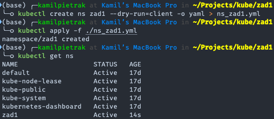
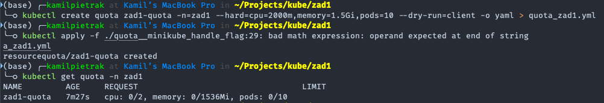
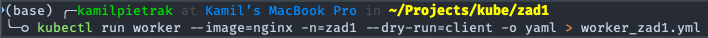
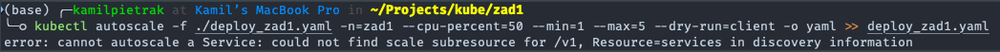
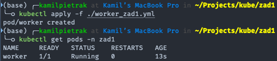
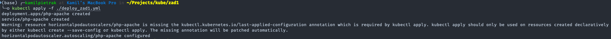
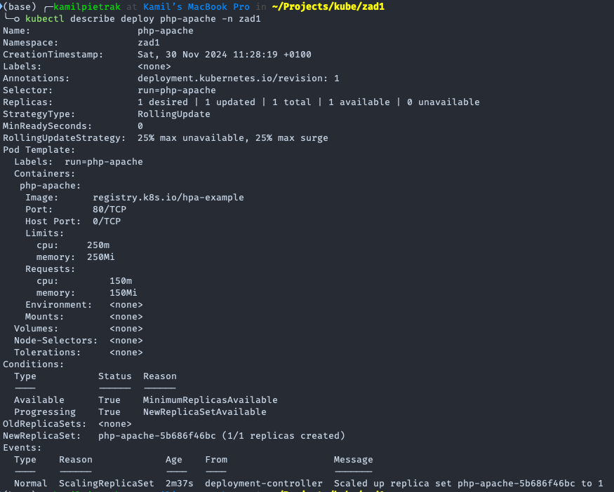
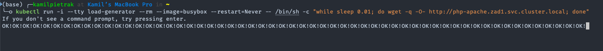
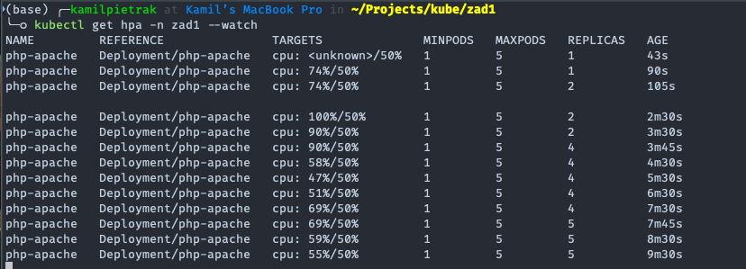

# Paraca domowa 1

## Część obowiązkowa

**Całość zadania ma być zrealizowana w przestrzeni nazw (namespace) o nazwie zad1. Na wstępie należy utworzyć manifest (plik yaml) deklarujący przestrzeń nazw zad1. Następnie uruchomić ten obiekt (tą przestrzeń nazw).**

Plik manifest z konfiguracją namespace o nazwie zad1 wygenerowałem za pomocą polecenia `kubectl create ns zad1 --dry-run=client -o yaml > ns_zad1.yml`. Wykonując to polecenie w terminalu został wygenerowany plik [ns_zad1.yml](./ns_zad1.yml) zawierający konfiguracje namespace. Aby utworzyć oprzestrzeń nazw wykorzystałem polecenie `kubectl apply -f ./ns_zad1.yml`. Efekt zaobserwowałem wykonując polecenie `kubectl get ns`.



**Następnie należy utworzyć zestaw plików manifestów (plików yaml) opisujących obiekty środowiska Kubernetes zgodnie z poniższymi założeniami:**

### Zadanie 1

**Utworzyć plik yaml tworzący dla przestrzeni nazw zad1 zestaw ograniczeń na zasoby (quota) o następujących parametrach:**

Utworzyłem plik manifestu dla "quota" za pomocą polecenia `kubectl create quota zad1-quota -n=zad1 --hard=cpu=2000m,memory=1.5Gi,pods=10 --dry-run=client -o yaml > quota_zad1.yml`. Polecenie to wygenerowało plik [quota_zad1.yml](./quota_zad1.yml) zawierający konfiguarcję quota. Następnie uruchomiono konfiguracje polecenie 'kubectl apply -f ./quota_zad1.yml'. Efekt zaobserwowałem wydając polecenie 'kubectl get quota -n zad1'.



### Zadanie 2

**Utworzyć plik yaml tworzący Pod-a w przestrzeni nazw zad1 o nazwie worker. Pod ma bazować na obrazie nginx i mieć następujące ograniczenia na wykorzystywane zasoby:**

Plik konfiguarcyjny dla poda o nazwie worker wygenerowałem poleceniem `kubectl run worker --image=nginx -n=zad1 --dry-run=client -o yaml > worker_zad1.yml`. Niestety polecenie to nie pozwala skonfigurować resources więc recznie dodałem wymagana konfiguracje do pliku manifestu. Finalny plik [worker_zad1.yml](./worker_zad1.yml) zosatł załączony w tym repozytorium.



### Zadanie 3

**Bazując na przykładzie application/php-apache.yaml i/lub z dokumentacji Kubernetes: <https://kubernetes.io/docs/tasks/run-application/horizontal-pod-autoscale-walkthrough/> należy zmodyfikować wskazany wyżej plik yaml tak by obiekty Deployment i Service utworzone zostały w przestrzeni nazw zad1. Jednocześnie obiekt Deployment ma mieć następujące ograniczenia na wykorzystywane zasoby:**

Pracę rozpoczołem od utworzenia nowego pliku yaml [deploy_zad1.yml](./deploy_zad1.yml) i wklejeniu w niego konfiguracji wumienionej w treści zadania. Następnie dodałem wymagana konfiguracje. Finalny kod wygląda następująco:

```yaml
apiVersion: apps/v1
kind: Deployment
metadata:
  name: php-apache
  namespace: zad1
spec:
  selector:
    matchLabels:
      run: php-apache
  template:
    metadata:
      labels:
        run: php-apache
    spec:
      containers:
      - name: php-apache
        image: registry.k8s.io/hpa-example
        ports:
        - containerPort: 80
        resources:
          limits:
            cpu: 250m
            memory: 250Mi
          requests:
            cpu: 150m
            memory: 150Mi
---
apiVersion: v1
kind: Service
metadata:
  name: php-apache
  labels:
    run: php-apache
  namespace: zad1
spec:
  ports:
  - port: 80
  selector:
    run: php-apache
---
apiVersion: autoscaling/v1
kind: HorizontalPodAutoscaler
metadata:
  creationTimestamp: null
  name: php-apache
  namespace: zad1
spec:
  maxReplicas: 5
  minReplicas: 1
  scaleTargetRef:
    apiVersion: apps/v1
    kind: Deployment
    name: php-apache
  targetCPUUtilizationPercentage: 50
status:
  currentReplicas: 0
  desiredReplicas: 0
```

### Zadanie 4

**Należy utworzyć plik yaml definiujący obiekt HorizontalPodAutoscaler, który pozwoli na autoskalowanie wdrożenia (Deployment) php-apache z zastosowaniem następujących parametrów:**

Plik manifest utworzyłem za pomocą komendy `bubectl autoscale -f ./deploy_zad1.yml -n=zad1 --cpu-percent=50 --min=1 --max=5 --dry-run=client -o yaml >> deploy_zad1.yml`. Komenda ta dodał konfigurację autoscalera do pliku manifest deploy utworzonego we wcześniejszym zadaniu.
Z obliczeń wyszło mi ze można utworzyć maxymalnie 5 podów. Quota pozwala na 1.5Gi memory - worker 250Mi - pody z deploy 5 * 250Mi Wynik tej komendy znajduje się w pliku [deploy_zad1.yml](./deploy_zad1.yml).



### Zadanie 5

**Należy utworzyć obiekty zdeklarowane w opracowanych plikach yaml. Następnie potwierdzić ich poprawne uruchomienie za pomocą samodzielnie dobranego polecenia (poleceń).**

Następnie wszytkie nie uruchomione plik uruchomiłem w kolejności w której były tworzone. Wyniki tych ioperacji przedstawiono ponizej.







### Zadanie 6

**Ponownie, bazując na przykładach z instrukcji do lab5 i/lub linku podanego w punkcie 3, należy uruchomić aplikację generującą obciążenie dla aplikacji php-apache i tym samym inicjalizujące proces autoskalowania wdrożenia tej aplikacji. Za pomocą samodzielnie dobranych poleceń i wyniku ich działania proszę potwierdzić dobór parametrów z punktu 4.**

Realizując to zadanie w jednym oknie/karcie terminala wyświetliłem hpa w przestrzeni nazw `zad1` utworzony w zadaniu 5. Następnie w drugiej karcie włączyłem load-generator za pomocą komendy `kubectl run -i --tty load-generator --rm --image=busybox --restart=Never -- /bin/sh -c "while sleep 0.01; do wget -q -O- http://php-apache.zad1.svc.cluster.local; done"`. Komenda ta wygenerowała poda który co 0.01 sekundy wysyła request http do uworzonego serwisu. Po chwili obserwacji w pierwszej karcie zaobserwowałem zmiany w hpa, wzrost liczby replik.





## Część nie obowiązkowa

### Zadanie 1

Należy odpowiedzieć na następujące pytania:

1. **Czy możliwe jest dokonanie aktualizacji aplikacji (np. wersji obrazu kontenera) gdy aplikacja jest pod kontrolą autoskalera HPA ? Proszę do odpowiedzi (TAK lub NIE) dodać link do fragmentu dokumentacji, w którym jest rozstrzygnięta ta kwestia.**

Odp.: TAK, możliwe jest zaktualizowanie aplikacji (np. wersji obrazu kontenera) w środowisku zarządzanym przez autoscaler HPA. W Kubernetes proces aktualizacji obrazu może być wykonany poprzez "rolling update", który zastępuje starsze wersje Podów nowymi w sposób kontrolowany, minimalizując przestoje i zachowując dostępność aplikacji. HPA (Horizontal Pod Autoscaler) działa na poziomie Deploymentu i monitoruje aktualny stan replik, dzięki czemu zmiany obrazu są obsługiwane jako część normalnych operacji Deploymentu.

Proces ten opisany jest na stronie <https://kubernetes.io/docs/tutorials/kubernetes-basics/update/update-intro/> gdzie pada zdanie że w poprzedniej części dodkonano skalowania a w tej zajmiemy się aktualizacją.

2. **Jeśli odpowiedź na poprzednie pytanie jest pozytywna to proszę podać przykładowe parametry strategii rollingUpdate, które zagwarantują, że:**

    a) Podczas aktualizacji zawsze będa aktywne 2 pod-y realizujące działanie przykładowej aplikacji oraz

    b) Nie zostaną przekroczone parametry wcześniej zdefiniowanej quoty dla przestrzeni zad1.

    c) Jeśli należy skorelować (zmieć) ustawienia autoskalera HPA z części obowiązkowej w związku z zaplanowaną strategią aktualizacji to należy również przedstawić te zmiany.

**Odpowiedź na pytanie 2 oraz dobór parametrów należy krótko uzasadnić.**

Odp.:

a) Parametry strategii rollingUpdate:
Aby zapewnić, że w trakcie aktualizacji zawsze będą aktywne co najmniej dwa Pody, można zastosować następujące ustawienia strategii rollingUpdate w konfiguracji Deploymentu:

```yaml
spec:
  replicas: 4
  strategy:
    type: RollingUpdate
    rollingUpdate:
      maxUnavailable: 0
      maxSurge: 1
```

- `maxUnavailable: 0` oznacza, że żaden istniejący Pod nie zostanie usunięty, zanim nowy nie stanie się dostępny.
- `maxSurge: 1` pozwala na uruchomienie maksymalnie jednego dodatkowego Poda podczas aktualizacji.

b) Zgodność z quotą zasobów:
Aby nie przekroczyć wcześniej zdefiniowanej quoty dla przestrzeni nazw, należy upewnić się, że konfiguracja HPA oraz wartości replicas w Deployment są zgodne z limitami CPU i pamięci zdefiniowanymi w przestrzeni.

c) Korelacja z ustawieniami HPA:
Jeśli HPA jest skonfigurowane na automatyczne skalowanie replik w zakresie np. od 2 do 5, należy dostosować minimalną liczbę replik do wymogów aktualizacji, aby zapobiec sytuacji, w której liczba Podów spada poniżej 2. Przykładowa zmiana konfiguracji HPA:

```yaml
spec:
  minReplicas: 2
  maxReplicas: 5
  targetCPUUtilizationPercentage: 50
```

Uzasadnienie:
Stała dostępność aplikacji:

1. **Parametry maxUnavailable:** 0 i maxSurge: gwarantują, że minimalna liczba działających Podów wynosi 2 podczas aktualizacji.

2. **Zgodność z limitami:** Precyzyjne zarządzanie liczbą replik oraz dostosowanie zasobów dla Podów zapewnia przestrzeganie wcześniej zdefiniowanych limitów.

3. **Skalowalność i optymalizacja:** HPA dostosowane do wymagań minimalnych oraz rzeczywistego zużycia CPU pozwala na dynamiczne skalowanie po zakończeniu aktualizacji.
